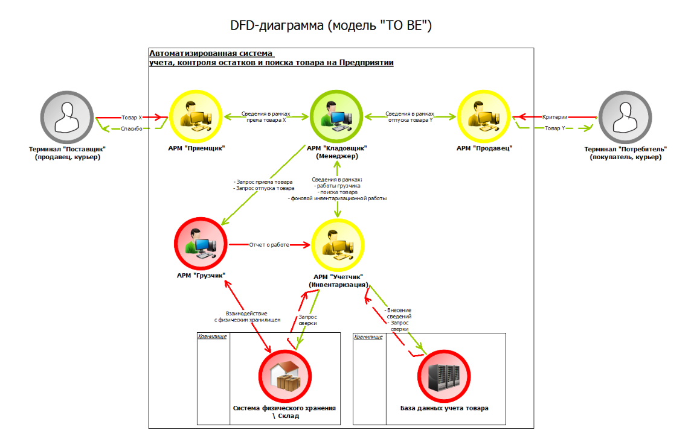

# Система учёта, контроля остатков и поиска товара на складе

Исследование в рамках изучения [методологии кибериммунной разработки](https://github.com/sergey-sobolev/cyberimmune-systems/wiki/)_

Пример [п. 7.1.](https://github.com/sergey-sobolev/cyberimmune-systems/wiki/%D0%98%D0%B4%D0%B5%D0%B8-%D0%B4%D0%BB%D1%8F-%D1%83%D1%87%D0%B5%D0%B1%D0%BD%D1%8B%D1%85-%D0%BF%D1%80%D0%B8%D0%BC%D0%B5%D1%80%D0%BE%D0%B2) выбран в качестве наиболее наглядного и доступного для понимания с целью повышения эффективности постижения [методологии кибериммунной разработки](https://github.com/sergey-sobolev/cyberimmune-systems/wiki/).

## Артефакты

### Активы

* товары;

### Угрозы безопасности

* поступающий на склад товар не учитывается;
* повторный учет товара;
* учитываемый поступающий на склад товар размещается в неконтролируемом месте;
* отпускаемые со склада товары не снимаются с учета;
* сведения об освободившемся на складе месте не обновляются при отпуске товара со склада;

### Цель безопасности

* состояние товара (физическое: как на складе, так и в рамках его движения - обобщим "на Предприятии") всегда соответствует сведениям в информационной системе;

### Подцели безопасности

* на Предприятии физически нет товара, который по сведениям информационной системы присутствует;
* в информационной системе нет сведений о физическом наличии товара, фактически отсутствующего на Предприятии;
* товары занимают ровно те места на Предприятии, которые указаны у них в информационной системе;

### Предположения безопасности

* Кладовщик - доверенная сторона;
* Приемщик, Продавец и Учетчик - повышающие доверие домены, они заинтересованы реализации цели безопасности;

### Допущения модели

* рассматриваемая модель работает в рамках авторизованого складского работника;
* оборот денежных средств моделью не рассматривается;
* товары поступают отдельно, одна упаковка - это один товар, партия товара дробится на единицы;

### Домены модели на физическом уровне

* АРМ "Поставщик" (DFD-тип: процесс; недоверенный, предоставляет интерфейс взаимодействия с продавцом или его представителем, в частности, курьером, не входит в схему);
* АРМ "Потребитель" (DFD-тип: процесс; недоверенный, не входит в схему);
* АРМ "Приемщик" (DFD-тип: процесс; повышающий доверие);
* АРМ "Продавец " (DFD-тип: процесс; повышающий доверие);
* АРМ "Кладовщик" (DFD-тип: процесс; доверенный; менеджер системы);
* АРМ "Грузчик" (DFD-тип: процесс; недоверенный);
* АРМ "Учетчик" (DFD-тип: процесс; повышающий доверие, реализует функции инспекционной работы в отношении деятельности грузчика и фоновой инвентаризационной работы в системе);
* Сисема физического хранения / Склад (DFD-тип: хранилище; недоверенный);
* База данных учета товара, в том числе его движения (DFD-тип: хранилище; недоверенный);

## Схемы

### Диаграмма потоков данных

