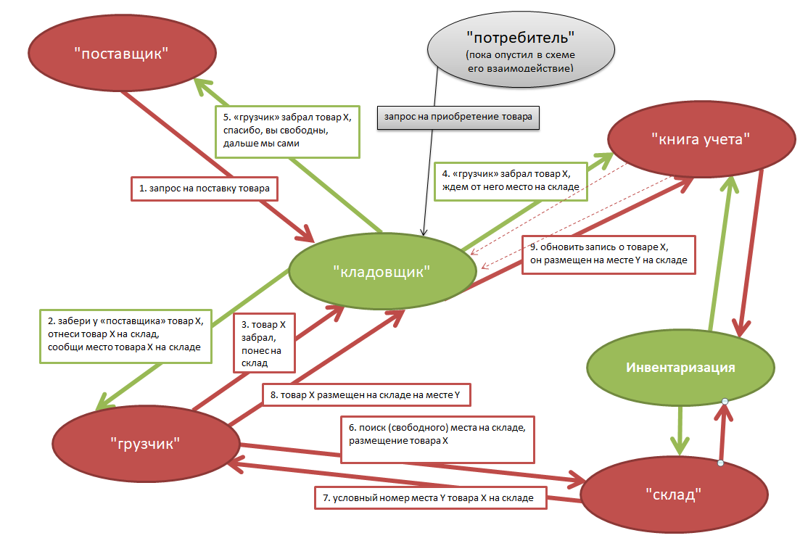

# Система учёта, контроля остатков и поиска товара на складе

_Исследование в рамках изучения методологии кибериммунной разработки - [п. 7.1.](https://github.com/sergey-sobolev/cyberimmune-systems/wiki/%D0%98%D0%B4%D0%B5%D0%B8-%D0%B4%D0%BB%D1%8F-%D1%83%D1%87%D0%B5%D0%B1%D0%BD%D1%8B%D1%85-%D0%BF%D1%80%D0%B8%D0%BC%D0%B5%D1%80%D0%BE%D0%B2)_  

Пример выбран в качестве наиболее наглядного и доступного для понимания с целью исследования [методологии кибериммунной разработки](https://github.com/sergey-sobolev/cyberimmune-systems/wiki/)_
 
## Артефакты

Активы: 
* товары

Угрозы: 
* поступающий на склад товар не учитывается
* повторный учет товара
* учитываемый поступающий на склад товар размещается в неусановленном месте
* отпускаемые со склада товары не снимаются с учета
* сведения об осавободившемся на складе месте не обновляются при отпуске товара со склада 

Цель:
* Обеспечение процесса учета товара, поступающего на склад 
* Обеспечение процесса снятия с учета товара, отпускаемого со склада
* Обеспечение процесса контроля остатков товара на складе
* Обеспечение процесса обнаружения товара на складе

Предположения безопасности:

Допущения:
* рассматриваемая модель работает в рамках авторизованого складского работника
* роли "учетчика" и "продовца" реализуются одним складским работником
* товары поступают отдельно, одна упаковка - это один товар
* оборот денежных средств моделью не рассматривается 

Домены:
* условный "поставщик"
* условный "потребитель"
* условный "грузчик"
* условный "кладовщик" - это доверенный "менеджер" в терминад методологии
* "книга учета"
* "склад"
* "инвентаризация"" - это доверенный "домен", сличает данные книги учета и сведений со склада, принимает решение об отсуствии расхождений

## Схемы

Пока опустил схему работы с "потребителем", дорисую в случае одобрения преподавателем схемы работы с "поставщиком".

Нагляднее, вилимо, буде нарисовать ниспадающий сценарий учета товара от поставщика в хронологии действий доменов

## Схема работы с поставщиком

